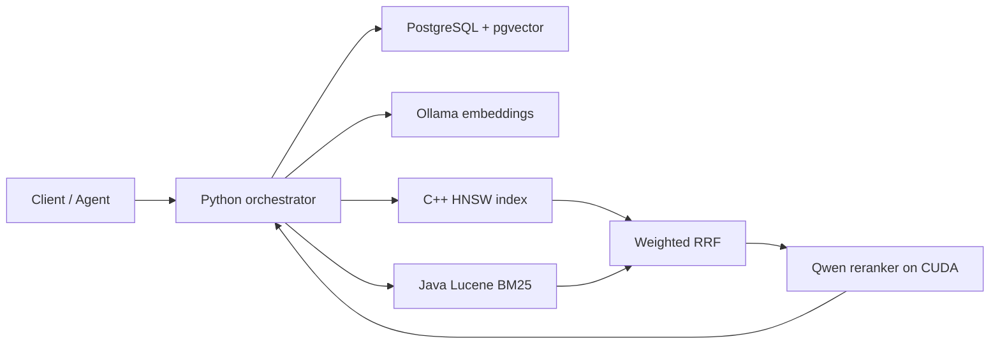

# Hybrid RAG Engine

A local-first hybrid retrieval service for source code and technical documents.
It combines dense retrieval, BM25, Reciprocal Rank Fusion (RRF), and a local
cross-encoder reranker behind a versioned HTTP API.

The system runs as six Docker Compose services. PostgreSQL is the source of
truth, while the C++ and Java services provide specialized retrieval indexes.

## Architecture



| Service | Responsibility | Host port |
| --- | --- | ---: |
| `orchestrator-python` | Ingestion, retrieval orchestration, API and evaluation | `8090` |
| `dense-index-cpp` | Exact linear and approximate HNSW vector search | `8081` |
| `lexical-index-java` | Lucene BM25 lexical search | `8082` |
| `reranker-python` | Cross-encoder reranking with Sentence Transformers | `8083` |
| `ollama` | Local embedding inference | `11434` |
| `postgres` | Documents, chunks, embeddings and evaluation runs | `5433` |

Compose uses the project name `hybrid-rag`, so container names are prefixed
with `hybrid-rag-`.

## Retrieval Pipeline

1. Scan a repository and split supported text files into line-aware chunks.
2. Redact recognized secret patterns and flag suspected prompt injection.
3. Generate normalized 1024-dimensional embeddings with Ollama.
4. Persist documents, chunks and embeddings in PostgreSQL.
5. Search the C++ HNSW index and Java BM25 index concurrently.
6. Combine both rankings with weighted RRF.
7. Optionally rerank post-RRF candidates with `Qwen/Qwen3-Reranker-0.6B`.
8. Return source paths, line ranges, scores and trust metadata through `/v1/search`.

Short and symbol-heavy queries keep a stronger RRF guardrail. Longer natural
language queries give the reranker more influence. The response preserves the
individual retrieval and reranker scores for inspection.

## Requirements

- Docker Desktop with Docker Compose
- NVIDIA GPU access from Docker for the default reranker configuration
- Enough disk space for Ollama, PyTorch/CUDA and the Hugging Face model cache
- PowerShell for the provided validation scripts

The tested machine uses an NVIDIA RTX 3060 12 GB. Model caches and persistent
indexes are stored in Docker volumes.

## Quick Start

Create the local configuration and start the stack:

```powershell
Copy-Item .env.example .env
docker compose up -d --build
```

Install the embedding model inside the Compose-managed Ollama service:

```powershell
docker compose exec ollama ollama pull qwen3-embedding:0.6b
```

Check the complete dependency graph:

```powershell
Invoke-RestMethod http://localhost:8090/health | ConvertTo-Json -Depth 8
```

The first reranked request may take longer while the Hugging Face model is
downloaded and loaded. Later starts reuse the `hf-model-cache` volume.

## Ingest a Corpus

The repository directory is mounted read-only at `/workspace` in the
orchestrator container. The first ingestion creates the corpus; there is no
separate corpus-creation endpoint.

```powershell
Invoke-RestMethod http://localhost:8090/ingest `
  -Method Post `
  -ContentType "application/json" `
  -Body '{"root_path":"/workspace","name":"hybrid-rag-engine"}'
```

Calling `/ingest` again with the same name performs an incremental ingestion:
unchanged documents retain their chunks and embeddings, changed files are
updated, and orphaned documents are removed.

Generate missing embeddings and rebuild both retrieval indexes:

```powershell
Invoke-RestMethod http://localhost:8090/embed `
  -Method Post `
  -ContentType "application/json" `
  -Body '{}'

Invoke-RestMethod http://localhost:8090/dense/reindex -Method Post
Invoke-RestMethod http://localhost:8090/lexical/reindex -Method Post
```

To ingest a different host repository, mount it under `/workspace` in
`docker-compose.yml`, then use its container path in `root_path`.

## Search API

`POST /v1/search` is the stable retrieval contract. `POST /search` remains as a
backward-compatible alias.

Minimal request:

```json
{
  "query": "where is incremental ingestion implemented",
  "top_k": 5
}
```

Request with reranking and filters:

```json
{
  "query": "function that removes orphaned documents after reingestion",
  "top_k": 5,
  "use_reranker": true,
  "filters": {
    "corpus": "hybrid-rag-engine",
    "path_prefix": "services/orchestrator-python/app/",
    "language": "python"
  }
}
```

PowerShell example:

```powershell
$body = @{
  query = "POST /ingest"
  top_k = 5
  use_reranker = $true
} | ConvertTo-Json

Invoke-RestMethod http://localhost:8090/v1/search `
  -Method Post `
  -ContentType "application/json; charset=utf-8" `
  -Body ([Text.Encoding]::UTF8.GetBytes($body))
```

Results include:

- corpus, path, language and line range
- chunk text and stable chunk ID
- dense, lexical and RRF contributions
- original and reranker ranks/scores when reranking is enabled
- content trust and security flags
- partial-failure details when one retrieval service is unavailable

A standard-library Python client is available in
[`examples/hybrid_rag_client.py`](examples/hybrid_rag_client.py).

## Evaluation and Validation

The curated evaluation endpoint compares C++ dense retrieval, pgvector, BM25,
RRF and reranked results:

```powershell
Invoke-RestMethod http://localhost:8090/evaluate `
  -Method Post `
  -ContentType "application/json" `
  -Body '{"top_k":5,"include_reranker":true}'
```

The final validated run recorded:

| Metric | Result |
| --- | ---: |
| HNSW recall@10 | `1.0000` |
| Search latency p95 without reranking | `309.65 ms` |
| Average CUDA reranker latency | `724.90 ms` |
| RRF MRR | `0.4861` |
| Reranked MRR | `0.5208` |
| RRF nDCG@5 | `0.5301` |
| Reranked nDCG@5 | `0.5577` |

These values describe the included curated corpus and should not be treated as
general-purpose benchmarks. Production corpora need their own relevance set.

Run local checks and the final adversarial suite with:

```powershell
.\scripts\check.ps1
.\scripts\final-redteam-stage16.ps1
```

The stage-specific scripts cover ingestion, embeddings, dense baselines, BM25,
RRF, reranking, observability, hardening, ANN persistence and API compatibility.
Acceptance reports are stored in [`reports/`](reports/).

## Failure Handling and Security Boundaries

- Downstream requests use bounded retries, timeouts and circuit breakers.
- Search can return a documented partial result if one retrieval index fails.
- Query, file, chunk and reranker candidate sizes are bounded.
- HNSW persistence uses an index file plus manifest and recovers from corruption.
- Suspected prompt injection is returned as untrusted retrieval metadata; the
  engine does not execute instructions found in indexed content.
- Recognized secret assignments and private-key material are redacted before
  chunks reach PostgreSQL. This is a guardrail, not a replacement for secret
  scanning before ingestion.

## Model Notes

Embeddings use `qwen3-embedding:0.6b` through Ollama. The originally evaluated
`sam860/qwen3-embedding:0.6b-F16` tag exists, but the tested official Ollama
server does not expose embedding inference for that tag.

Reranking runs outside Ollama with `Qwen/Qwen3-Reranker-0.6B` through Sentence
Transformers. CUDA is selected when available. The service uses a persisted
Hugging Face cache to avoid downloading the model on every start.

## Project Using This Engine

[`fareloj/tgr01-trading-llmv2`](https://github.com/fareloj/tgr01-trading-llmv2)
uses this project as its primary RAG retrieval backend. The trading application
consumes the versioned search API and remains separate from retrieval internals.

## Documentation

- [`rag-hybrid-planning/PROJECT.md`](rag-hybrid-planning/PROJECT.md): scope and architecture decisions
- [`rag-hybrid-planning/ROADMAP.md`](rag-hybrid-planning/ROADMAP.md): implementation stages and acceptance criteria
- [`reports/stage16-final-acceptance.md`](reports/stage16-final-acceptance.md): final acceptance summary
- [`reports/stage16-final-redteam.json`](reports/stage16-final-redteam.json): machine-readable final measurements

## Known Limitations

- The default Compose configuration expects NVIDIA GPU access for the reranker.
- Initial model downloads require network access and several gigabytes of disk.
- The lexical index is rebuilt from PostgreSQL rather than persisted separately.
- Relevance weights are calibrated for the included dataset and may require
  adjustment for a substantially different corpus.
- This repository provides retrieval and ranking; answer generation belongs to
  the consuming application or agent.

## Acknowledgment

This project was developed and validated with the assistance of OpenAI Codex.
